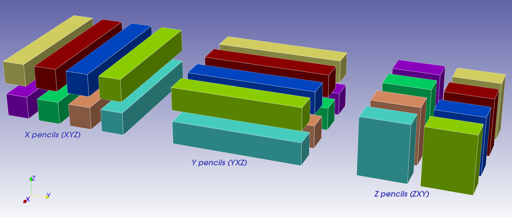

# dtFFT -  DataTyped Fast Fourier Transform

[]()
[](https://travis-ci.com/ShatrovOA/dtFFT)
[](https://codecov.io/gh/ShatrovOA/dtFFT)
[]()

This repository contains new library to perform FFT on a distibuted memory cluster. It is written in modern Fortran and uses MPI to handle communications between processes.  
The main idea of this library is to implement zero-copy algoritms in 2d and 3d cases. It uses advance MPI to create send and recieve MPI datatypes in a such way that recieved memory will be aligned in memory and ready run 1d FFT.

Following Fortran column-major order consider XYZ is a three-dimensional buffer: X index varies most quickly. dtFFT will create MPI derived datatypes which will produce 
- Forward transform: XYZ --> YXZ --> ZXY
- Backward transform: ZXY --> YXZ --> XYZ



**Table of Contents**
- [Features](#features)
- [Usage](#usage)
  - [Plan creation](#plan-creation)
  - [Execution](#execution)
- [Installation](#installation)
- [Notes for C users](#notes-for-c-users)
- [Limitations](#limitations)
- [Known issues](#known-issues)
- [Other notes](#other-notes)
- [Next Steps](#next-steps)
- [Contribution](#contribution)
- [Licensing](#licensing)
## Features
- R2C, C2C, R2R (FFTW3 only) transforms are supported
- Single and double precision
- Fortran and C interfaces
- 2D and 3D transposition plans
- Slab and Pencil decompositions
- Can be linked with multiple FFT libraries simultaneously. Execution library can be specified during plan creation. Currenly supported libraries are:
  -  FFTW3
  -  MKL


## Usage
Basic usage of dtFFT consists of 6 steps:
- Create plan
- Get local sizes in "real" and "Fourier" spaces
- Get local sizes of work buffer (optional)
- Allocate memory
- Execute plan as many times as you want
- Destroy plan

### Plan creation
Two subroutines are available to create plan: ```create``` and ```create_f```. First one will use double precision arithmetics. Second - single precision. User is free to provide two kinds of communicators. Without grid topology: ```MPI_COMM_WORLD``` and with created cartesian topology. dtFFT will handle both of such cases and create needed communicators. 

Plan creation subroutines have two optional arguments:
- effort_flag - currently this argument is ignored. Main idea of this argument is to find best processor grid (in case user provided MPI_COMM_WORLD as comm argument) and fastest datatypes.
- executor_type - this argument specifies which external library should be used to create and execute 1d FFT plans. Note that if you specify incorrect value then runtime error will occur.

### Execution
When executing plan (except for R2C plans) user must provide ```transpose_type``` argument. Two options are available: ```DTFFT_TRANSPOSE_OUT``` and ```DTFFT_TRANSPOSE_IN```. First one assumes that incoming data is aligned in X direction (fastest) and return data aligned in Z direction. 

All three-dimensional plans and R2C two-dimensional plans have an option to provide ```work``` buffer. This buffer can be utilized by dtFFT to store intermediate data. If user do not provide such buffer during the first call to dtFFT, necessary memory will be allocated. This will likely make first execution quite slow. Internal work memory will be released when user calls ```destroy``` subroutine.

For more detaled examples check out tests provided in ```tests/fortran``` folder.
## Installation
To build this library modern (2008+) Fortran compiler is required. This library successfully builds with gfortran-7 and above, ifort-18 and above. Currenly library can only be build using GNU Make. One should modify ```Makefile.inc``` present in the root of a project in order to build library with required compiler, flags and external FFT engines. Both static and shared libraries can be build. After modifing ```Makefile.inc``` simply run ```make -j``` to build library. Other supported rules are:
- tests - will compile and link tests shipped with library
- check - will execute tests
- coverage - will run gcov on executed tests
- doc - will build API doc with the help of [ford](https://github.com/Fortran-FOSS-Programmers/ford)
- clean - will remove build and exe directories and gcov files.

## Notes for C users
C interface of the library is available. Simply 
```c
#include <dtfft.h>
```
and tell compiler where it should search for it:
```bash
mpicc ... -I<path_to_dtfft>/include ...
```
Since C arrays are stored in row-major order which is opposite to Fortran column-major when creating the plan, user should pass the dimensions of the array to the planner in reverse order. For example, if your array is a rank three N x M x L matrix in row-major order, you should pass the dimensions of the array as if it were an L x M x N matrix. Also if you are using R2R transform and wish to perform different transform kinds on different dimensions then buffers ```in_kinds``` and ```out_kinds``` should also be reversed.

When you link you code to dtFFT library you should also link Fortran core libraries:
- gcc: -lgfortran
- Intel: -lifcore -lifcoremt
- Nvidia: -pgf90libs

It is also required to link MPI library in case your compiler doesn't do this. For example, if you use Open MPI then ```-lmpi_usempif08``` must be passed to linker.

For more detaled examples check out examples provided in ```tests/c``` folder.

## Limitations
- It is currently undefined how dtFFT will behave if number of MPI processes in a single dimension will be greater than local number of points in same dimension. User should be extra carefull when creating R2C plan.
- In-place transform is not available for 2d plans (except for R2C). This is due to the way MPI_Alltoall(w) works. User should pass different buffers to the execution routines.
- In-place transform is not available for 3d R2C plan.
- Even cuFFT interface is present in dtFFT, it is not recommended to use it due to this [issue](https://github.com/open-mpi/ompi/issues/8720).

## Known issues
In some cases 3D r2c transform may fail. This happens because I use user-provided complex buffer as a result of 1d r2c transform. If user allocates memory using ```out_counts``` values from ```get_local_sizes``` subroutine, then r2c transform may fail due to insufficient memory allocated. It is strongly recommended to allocate complex buffer using ```alloc_size``` value from the same routine. Note for C users: ```alloc_size``` is returned by ```dtfft_get_local_sizes``` function.

## Other notes
This library is quite new and its API may likely to be changed in the future.
## Next Steps

- [ ] Support effort_flag optional argument.
- [ ] Support more 1d FFT executors. ESSL, FFTPACK?
- [ ] Use different tools to build project: autotools, CMake?
- [ ] Add more interfaces: C++, Python?
## Contribution

You can help this project by reporting problems, suggestions, localizing it or contributing to the code. Go to issue tracker and check if your problem/suggestion is already reported. If not, create a new issue with a descriptive title and detail your suggestion or steps to reproduce the problem.

## Licensing

The source code is licensed under GPL v3. License is available [here](/LICENSE).