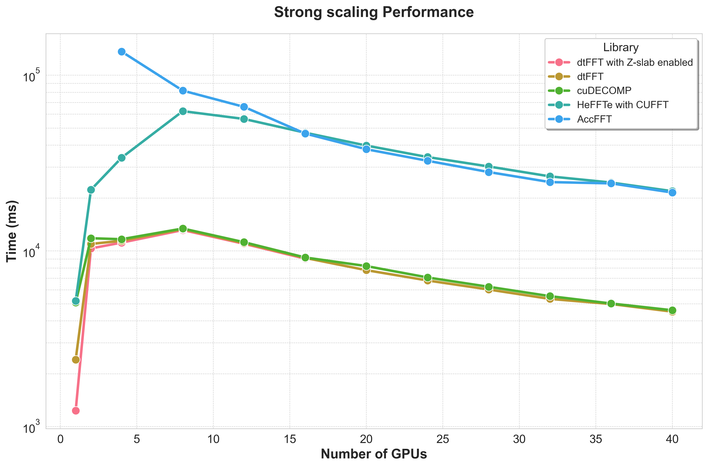
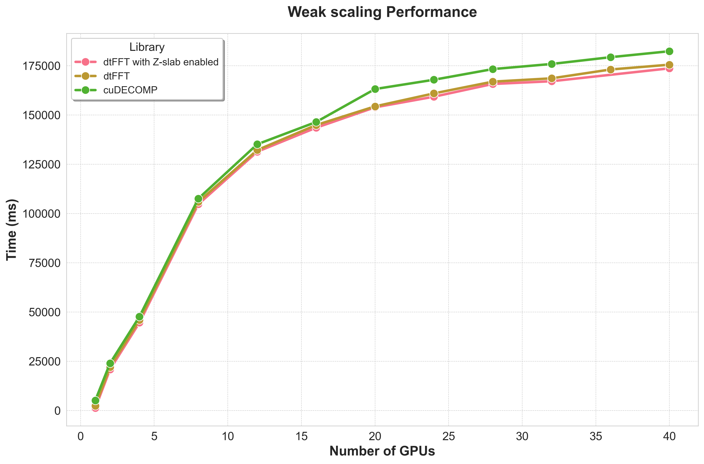

Benchmark Overview
==================

This section presents a performance analysis of the dtFFT library against several alternatives, based on benchmarks conducted on a GPU cluster.

Test Environment
----------------

- **Hardware:** 10 nodes, each with 4x NVIDIA Volta V100 GPUs (32 GB HBM2), connected via 56G InfiniBand.
- **Software:** NVHPC 24.7, CUDA 11.8.
- **Libraries:** ``dtFFT`` v2.2.0, ``cuDECOMP`` v0.5.1, ``HeFFTe`` v2.4.1, and ``AccFFT`` (latest from repository).
- **Problem Size:** A 3D grid of :math:`1024 \times 1024 \times 512` was used for all tests.
- **Methodology:** Each benchmark was run for 50 iterations. The reported time is the **average wall-clock time per iteration** (total time / 50), 
  in milliseconds.
- **Precision:** To ensure a fair comparison with an 8-byte element size, ``dtFFT`` and ``cuDECOMP`` were benchmarked using double-precision, 
  while ``HeFFTe`` and ``AccFFT`` used single-precision complex-to-complex transforms.
- **Communication Backend:** For ``dtFFT`` and ``cuDECOMP``, the ``NCCL`` backend was manually selected for inter-GPU communication, 
  as it is known to be the most performant on this hardware. The backend auto-tuning feature was therefore not utilized. 
  In contrast, ``HeFFTe`` and ``AccFFT`` rely on a CUDA-aware MPI implementation with UCX for data transfers.

Strong Scaling Analysis
-----------------------

Strong scaling evaluates performance by keeping the total problem size constant while increasing the number of GPUs. The results clearly demonstrate the impact of the underlying hardware communication topology.

- **1 GPU (Baseline):** With no inter-GPU communication, ``dtFFT`` with Z-slab optimization delivers the fastest performance (**1233 ms**), 
  establishing a strong baseline.
- **2 GPUs (Intra-Socket, PCI-e v3):** At two GPUs, communication occurs over the PCI-e v3 bus. 
  The high cost of this communication channel outweighs the benefits of parallelization, leading to a 
  significant **increase in runtime** across all libraries. This is an expected bottleneck for this hardware configuration.
- **4 GPUs (Inter-Socket):** With four GPUs, communication extends across two CPU sockets. While performance 
  improves relative to the 2-GPU case for some libraries, the overhead remains substantial.
- **8+ GPUs (Network, InfiniBand):** When scaling to 8 or more GPUs, communication shifts to the 56G InfiniBand network. 
  The benchmark shows that ``dtFFT`` and ``cuDECOMP`` scale effectively in this regime, indicating that the network 
  interconnect is well-suited for this workload.

Weak Scaling Analysis
---------------------

Weak scaling assesses performance by increasing both the problem size and the number of GPUs, keeping the workload per GPU constant. 
``HeFFTe`` and ``AccFFT`` were excluded from these tests due to their lower relative performance and because their MPI-based data management led to GPU memory exhaustion as the problem size increased.

- **Performance Trend:** As expected, runtimes gradually increase with the number of GPUs. 
  This reflects the inherent cost of synchronizing a larger number of distributed processes over the network.
- **Comparative Performance:** ``dtFFT`` (both variants) and ``cuDECOMP`` exhibit very similar scaling behavior, 
  confirming that ``dtFFT`` is highly efficient for large, distributed problems.

Detailed Performance Data
-------------------------

The following tables present the complete timing data from our benchmark runs, serving as the foundation for the analysis above. 
All times are reported in milliseconds.

The **Strong Scaling** table illustrates the time-to-solution for a fixed problem size as more GPUs are added. 
This measures how well the libraries handle parallelization.

.. csv-table:: Strong scaling results
	:header: "Number of GPUs", "dtFFT with Z-slab enabled", "dtFFT", "cuDECOMP", "HeFFTe with CUFFT", "AccFFT"
	:widths: 10, 15, 10, 12, 15, 10

	1, 1233, 2406, 5089, 5194, -
	2, 10341, 10963, 11818, 22308, -
	4, 11157, 11433, 11667, 33943, 136429
	8, 13152, 13327, 13423, 62498, 81778
	12, 10988, 11087, 11221, 56414, 66110
	16, 9043, 9130, 9182, 47118, 46586
	20, -, 7776, 8204, 39805, 37936
	24, -, 6793, 7067, 34249, 32609
	28, -, 6034, 6253, 30260, 28131
	32, -, 5336, 5533, 26578, 24664
	36, -, 4990, 5025, 24519, 24251
	40, -, 4515, 4599, 21898, 21506

The **Weak Scaling** table shows the time-to-solution as the problem size grows proportionally with the number of GPUs, 
keeping the workload per GPU constant. This measures scalability for larger problems.

.. csv-table:: Weak scaling results
	:header: "Number of GPUs", "dtFFT with Z-slab enabled", "dtFFT", "cuDECOMP"
	:widths: 10, 15, 12, 12

	1, 1233, 2406, 5089
	2, 20833, 22035, 23930
	4, 44643, 45920, 47634
	8, 104696, 105888, 107538
	12, 131328, 132175, 135118
	16, 143514, 144869, 146405
	20, 153856, 154343, 163137
	24, 159255, 160935, 167862
	28, 165720, 166899, 173269
	32, 167104, 168581, 175875
	36, -, 173065, 179312
	40, 173651, 175504, 182334

Conclusions
-----------

1. **Z-Slab is Key for Single-GPU:** The Z-slab optimization provides a critical performance advantage when communication is not a factor.
2. **Hardware Topology is Dominant:** The performance curve is dictated by the communication hierarchy: 
   intra-GPU is fastest, followed by network (InfiniBand), with PCI-e and inter-socket communication proving to be significant bottlenecks 
   for this problem size.
3. **Excellent Multi-Node Scalability:** ``dtFFT`` demonstrates strong scalability and is highly competitive with ``cuDECOMP`` 
   in multi-node environments (8+ GPUs).