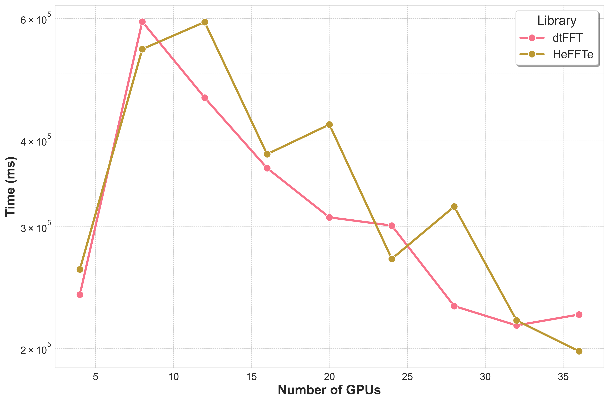
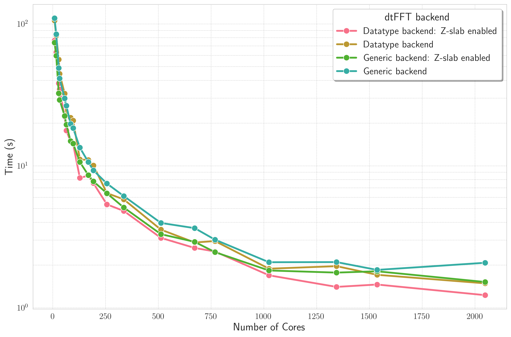
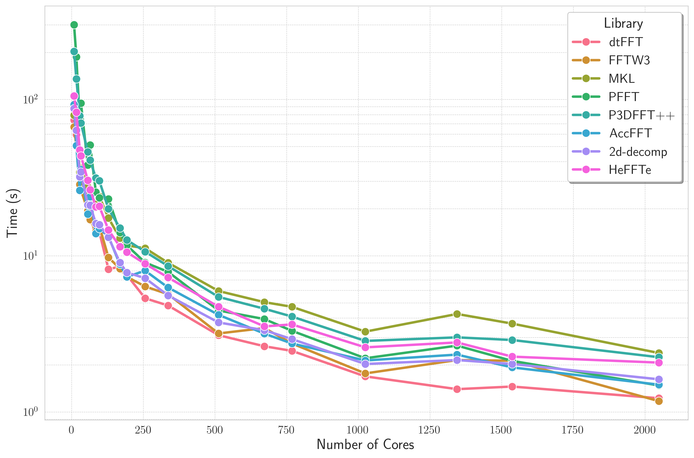
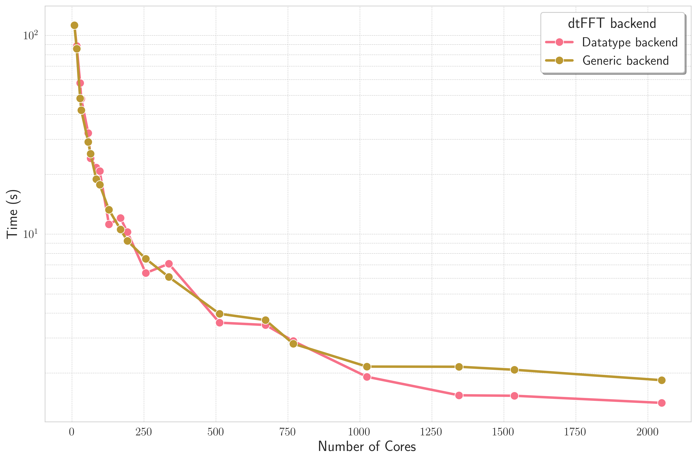
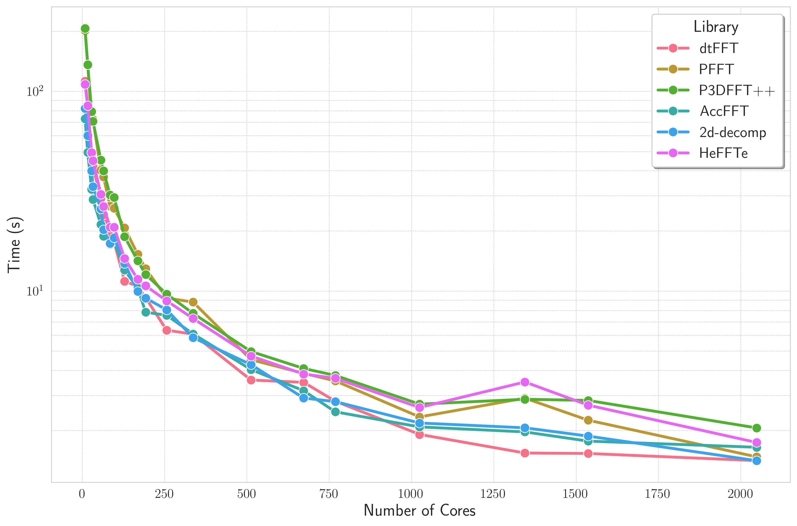

Benchmark Overview
==================

CUDA Benchmarks
---------------

- **Hardware:** 10 nodes, each with 4x NVIDIA Volta V100 GPUs (32 GB HBM2), connected via 56G InfiniBand.
- **Software:** NVHPC 24.7, CUDA 11.8.
- **Libraries:** ``dtFFT`` v3.0.0, ``cuDECOMP`` v0.6.0, ``HeFFTe`` v2.4.1, and ``2DECOMP&FFT`` latest from GitHub.
- **Problem Size:** A 3D grid of :math:`1024 \times 1024 \times 1024` was used for all tests.
- **Methodology:** Each benchmark was run for 50 iterations performing both forward and backward transforms. The reported time is the maximum time taken by any GPU over all iterations.
- **Precision:** Double precision complex-to-complex (C2C) transforms were performed.
- **Communication Backend:** Only MPI-based communication was evaluated for multi-GPU tests.
- **FFT Libraries:** All libraries utilized NVIDIA's cuFFT for local FFT computations.
- **Additional information:** UCX and CUDA IPC are disabled.

Strong Scaling
______________

.. image:: images/gpu_competitors_performance.png
	:alt: Strong scaling performance
	:align: center
	:width: 700px

.. csv-table:: Strong scaling results
  :header: "Number of GPUs", "dtFFT", "cuDECOMP", "HeFFTe", "2DECOMP&FFT"
  :widths: 10, 15, 15, 15, 15
  :align: right

  4,  119626.641, 121721.242, 121098.586, 120167.854
  8,  204371.359, 204187.656, 203894.516, 204669.592
  12, 167539.578, 168842.437, 168267.093, 167885.206
  16, 137827.844, 138721.703, 138234.469, 138201.588
  20, 117795.039, 119350.664, 118823.680, 117924.865
  24, 101455.992, 103170.719, 102516.188, 101612.259
  28,  89294.328,  91382.023,  90897.547,  89335.099
  32,  79008.461,  81047.414,  80815.453,  79230.639
  36,  72392.461,  73923.062,  73583.375,  72661.824

Bricks Strong Scaling
_____________________

Grid decomposition created via ``MPI_Dims_create``.

.. .. csv-table:: Bricks Strong scaling results
..   :header: "Number of GPUs", "dtFFT", "HeFFTe"
..   :widths: 10, 15, 15

..     4, 239393.781, 260304.312
..     8, 593468.312, 541668.375
..     12, 460852.781, 592682.000
..     16, 364630.188, 381815.281
..     20, 309458.875, 421467.810
..     24, 301119.656, 269521.781
..     28, 230388.875, 320762.406
..     32, 215990.906, 219637.906
..     36, 223956.547, 198191.578

Host Benchmarks
---------------

Weak Scaling
____________

C2C Double Precision; initial grid is :math:`128 \times 128 \times 128`; no FFT is executed

.. image:: images/dtfft_weak_scaling_performance.png
	:alt: Bricks Strong Scaling
	:align: center
	:width: 700px

.. .. csv-table:: Weak scaling results of dtFFT (C2C Double Precision: 128x128x128); no FFT is executed
..   :header: "Number of Cores", "Datatype backend: Z-slab enabled", "Datatype backend", "Basic backend: Z-slab enabled", "Basic backend"
..   :widths: 10, 20, 20, 20, 20

..   1,     0.773,  1.557,  0.749,  1.567
..   2,     2.391,  3.725,  1.673,  3.034
..   4,     3.290,  5.133,  1.811,  2.916
..   8,     3.756,  6.884,  2.591,  4.082
..   16,    3.800,  6.364,  4.445,  7.006
..   32,    3.716,  6.788,  4.642,  6.888
..   64,    4.933,  8.125,  5.942,  8.637
..   128,   5.057,  9.155,  7.470, 11.173
..   256,   7.816, 11.373, 10.680, 13.391
..   512,   8.661, 13.690, 11.923, 15.903
..   1024, 12.656, 15.142, 14.341, 19.169
..   2048, 13.625, 16.919, 14.995, 20.376

Strong Scaling
______________

C2C Double Precision; :math:`64 \times 2048 \times 2048`; FFTW3 executor

C2C Double Precision; :math:`2048 \times 2048 \times 64`; FFTW3 executor

Bricks Strong Scaling
_____________________

C2C Double Precision; :math:`1024 \times 1024 \times 1024`; FFTW3 executor.
Grid created via ``MPI_Dims_create``.

.. image:: images/bricks_performance.png
	:alt: Competitors Strong Scaling narrow
	:align: center
	:width: 700px
