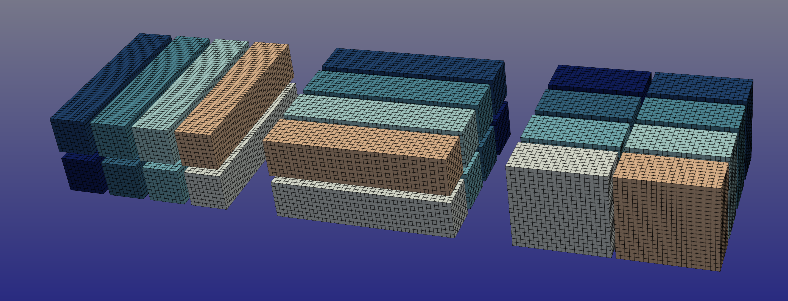

##############################
Welcome to dtFFT Documentation
##############################

Usage Guide
===========

``dtFFT`` (DataTyped Fast Fourier Transform) is a high-performance library designed for parallel data transpositions and optional 
Fast Fourier Transforms (FFTs) in multidimensional computing environments.

``dtFFT`` aims to optimize following cycles of transformations (forward and backward):

.. math::
   X \times \dfrac{Y}{P_1} \to Y \times \dfrac{X}{P_1}

for 2D case, and

.. math::
   X \times \dfrac{Y}{P_1} \times \dfrac{Z}{P_2} \to Y \times \dfrac{Z}{P_2} \times \dfrac{X}{P_1} \to Z \times \dfrac{X}{P_1} \times \dfrac{Y}{P_2}

for 3D case. Where :math:`X, Y, Z` are the spatial dimensions of the data, and :math:`P_1, P_2` are the number of processes in the :math:`Y` and :math:`Z` directions, respectively.

Initially developed to perform zero-copy transpositions using custom MPI datatypes on CPU clusters, ``dtFFT`` leverages these 
efficient data structures to minimize memory overhead in distributed systems. However, as the demand for GPU-accelerated computing 
increased, it became evident that MPI datatypes were suboptimal for GPU workflows. To address this limitation, a parallel approach was developed for 
GPU execution: instead of relying on custom datatypes, ``dtFFT`` compiles CUDA kernels at runtime using ``nvrtc``, tailoring them 
to the specific plan and data layout.

The library supports MPI for distributed systems and GPU acceleration via CUDA, integrating seamlessly with external FFT libraries 
such as FFTW3, MKL DFTI, cuFFT, and VkFFT, or operating in transpose-only mode.

Whether you are working on CPU clusters or GPU-enabled nodes, ``dtFFT`` provides a flexible and efficient framework for scientific 
computing tasks requiring large-scale data transformations.

This documentation covers the essentials of building and using ``dtFFT``. Please explore the sections below to get started.

Getting Started
===============

To begin using ``dtFFT``:

1. **Build the Library**: Follow the instructions in :ref:`Building the Library<building_link>` to compile ``dtFFT`` with your desired features (e.g., CUDA or FFTW3 support).
2. **Use the Library**: Refer to the :ref:`Usage Guide<usage_link>` for step-by-step examples of creating plans, allocating memory, and executing transformations.
3. **Configure Runtime**: Set environment variables as needed (see :ref:`Environment Variables<environ_link>`) to adjust logging or datatype selection.

Detailed API specifications are available in the Fortran, C, and C++ sections.

Contributing
============

Feedback, bug reports, and contributions are welcome. Please submit issues or pull requests via the project's `repository <https://github.com/ShatrovOA/dtFFT>`_. 
For API-specific details, consult the respective language sections.

Table of Contents
=================
.. toctree::
   :maxdepth: 2

   build
   usage
   api_fortran
   api_c
   api_cxx
   environ
   benchmarks
