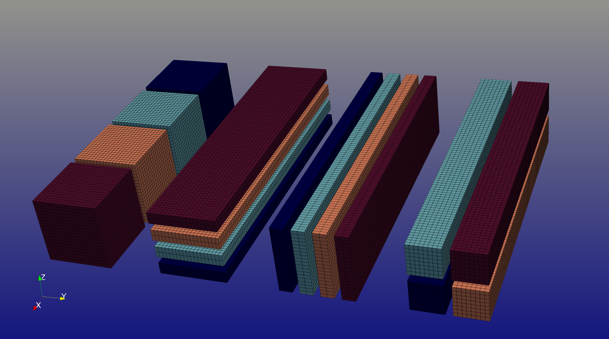

:tocdepth: 3

.. _usage_link:

###########
Usage Guide
###########

This guide provides a comprehensive overview of using the ``dtFFT`` library to perform parallel data transpositions and optionally
Fast Fourier Transforms (FFTs) across host and GPU environments.
Designed for high-performance computing, ``dtFFT`` simplifies the process of decomposing multidimensional data, managing memory,
and executing transformations by integrating with external FFT libraries or operating in ``Transpose-Only`` mode.

Whether targeting CPU clusters with MPI or GPU-accelerated systems with CUDA, this library offers flexible configuration options to
optimize performance for specific use cases. The following sections detail key aspects of working with ``dtFFT``, from plan creation to
execution and resource management, with practical examples in Fortran, C, and C++.

Error Handling and Macros
=========================

Almost all ``dtFFT`` functions return error codes to indicate whether execution was successful. These codes help users identify and handle issues during plan creation, memory allocation, execution, and finalization. The error handling mechanism differs slightly across language APIs:

- **Fortran API**: Functions include an optional ``error_code`` parameter (type ``integer(int32)``), always positioned as the last argument.
  It is always recommended to check the returned error code after each call.
- **C API**: Functions return a value of type :cpp:type:`dtfft_error_t`, allowing direct inspection of the result.
- **C++ API**: Most functions return :cpp:type:`dtfft::Error`. Some overloads throw :cpp:type:`dtfft::Exception` on error instead.

To simplify error checking, ``dtFFT`` provides predefined macros that wrap function calls and handle error codes automatically:

- **Fortran**: The ``DTFFT_CHECK`` macro, defined in ``dtfft.f03``, checks the ``error_code`` and halts execution with an informative message if an error occurs. Include this header with ``#include "dtfft.f03"`` to use it. Note: using this macro requires preprocessing.
- **C**: The ``DTFFT_CALL`` macro wraps function calls, checks the returned :c:type:`dtfft_error_t`, and triggers an appropriate response (printing an error message and exiting) if the call fails.
- **C++**: The ``DTFFT_CXX_CALL`` macro similarly wraps calls, throws a C++ exception, and displays an error message.

Below is an example demonstrating error handling with these macros:

.. tabs::

  .. code-tab:: fortran

    #include "dtfft.f03"

    ...

    call plan%execute(a, b, DTFFT_EXECUTE_FORWARD, error_code=error_code)
    DTFFT_CHECK(error_code)  ! Halts if error_code != DTFFT_SUCCESS

    ...

  .. code-tab:: c

    #include <dtfft.h>

    ...

    DTFFT_CALL( dtfft_execute(plan, a, b, DTFFT_EXECUTE_FORWARD, NULL) )

    ...

  .. code-tab:: c++

    #include <dtfft.hpp>

    ...

    DTFFT_CXX_CALL( plan.execute(a, b, dtfft::Execute::FORWARD, nullptr) );

Plan Creation
=============

dtFFT supports three plan categories, each tailored to specific transformation requirements:

- Real-to-Real (R2R)
- Complex-to-Complex (C2C)
- Real-to-Complex (R2C)

dtFFT provides two complementary workflows for constructing a plan:

1. **Global-dimension workflow** – supply the global lattice extents and allow ``dtFFT`` to derive the process decomposition. This workflow is detailed in `Global-Dimension Workflow`_.
2. **Local-decomposition workflow** – supply the portion of the domain owned by each MPI rank via a pencil descriptor. This workflow is described in `Local-Decomposition Workflow`_.

Both workflows share the same configuration surface (plan category, precision, executor, and effort level); they differ only in how the data distribution is communicated to the library.

Global-Dimension Workflow
-------------------------

This default workflow constructs a plan by providing the global array dimensions (in Fortran order) together with the MPI communicator. ``dtFFT`` deduces the process decomposition from that information, optionally complemented by the optimization effort and FFT executor parameters.

Plans are instantiated through the ``create`` method or the corresponding language-specific constructor, as described in the Fortran, C, and C++ API sections. Every plan accepts an MPI communicator that defines the process distribution. 

When the global-dimension workflow is used, ``dtFFT`` must derive how the global domain is partitioned across MPI ranks. The subsections below outline the default strategy and how to supply a custom topology. Users employing the local-decomposition workflow already provide this information explicitly through the pencil descriptor and can skim this section.

**Default Behavior**

When the communicator passed during plan creation is ``MPI_COMM_WORLD`` with :math:`P` processes, ``dtFFT`` attempts the following steps in order:

- If :math:`P <= N_z` (and :math:`N_z / P >= 32` for the GPU version), split the grid as :math:`N_x \times N_y \times N_z / P`. 
  This distributes the Z-dimension across :math:`P` processes. Division need not be even, and the local size per process may vary.
- If the Z-split fails (e.g., :math:`P > N_z` or :math:`N_z / P < 32` on GPU), attempt :math:`N_x \times N_y / P \times N_z`. 
  This distributes the Y-dimension across ``P`` processes, provided :math:`P \le N_x` to remain compatible with future transpositions (e.g., Y-to-X, which results in :math:`N_y \times N_z \times N_x / P`).
- If both attempts fail, ``dtFFT`` constructs a 3D communicator by fixing the X-dimension split to 1 and using ``MPI_Dims_create(P, 2, dims)`` 
  to balance the remaining :math:`P` processes across :math:`Y` and :math:`Z`, resulting in :math:`N_x \times N_y / P_1 \times N_z / P_2` 
  (where :math:`P_1 \times P_2 = P`).
- If this 3D decomposition is not viable (e.g., :math:`N_y < P_1` or :math:`N_z < P_2`), ``dtFFT`` proceeds but prints a warning message. 
  Ensure :ref:`DTFFT_ENABLE_LOG<dtfft_enable_log_env>` is enabled to observe it.

**User-Controlled Decomposition**

Applications may supply a communicator with an attached Cartesian topology. Grid dimensions must be provided in Fortran order (X, Y, Z).

- **1D Communicator**: A one-dimensional communicator with :math:`P` processes splits the grid as :math:`N_x \times N_y \times N_z / P`, distributing the Z-dimension across :math:`P` processes.
- **2D Communicator**: A two-dimensional communicator with topology :math:`P_1 \times P_2` (where :math:`P_1 * P_2 = P`) decomposes the grid as :math:`N_x \times N_y / P_1 \times N_z / P_2`, splitting :math:`Y` by :math:`P_1` and :math:`Z` by :math:`P_2` while keeping :math:`X` indivisible.
- **3D Communicator**: A three-dimensional communicator with topology :math:`P_0 \times P_1 \times P_2` (where :math:`P_0 * P_1 * P_2 = P`) is supported, but :math:`P_0` (the X split) must be 1 to preserve the fastest-varying dimension.  Violating this constraint triggers :f:var:`DTFFT_ERROR_INVALID_COMM_FAST_DIM`.

The example below illustrates the global-dimension workflow by creating a 3D C2C double-precision ``Transpose-Only`` plan:

.. tabs::

  .. code-tab:: fortran

    #include "dtfft.f03"
    ! dtfft.f03 contains macro DTFFT_CHECK
    use iso_fortran_env
    use dtfft
    use mpi ! or use mpi_f08

    type(dtfft_plan_c2c_t) :: plan
    integer(int32) :: dims(3)
    integer(int32) :: error_code
    type(dtfft_effort_t) :: effort = DTFFT_PATIENT
    type(dtfft_precision_t) :: precision = DTFFT_DOUBLE
    type(dtfft_executor_t) :: executor = DTFFT_EXECUTOR_NONE

    call MPI_Init()

    ! Set dimensions
    dims = [32, 32, 32]

    ! Creating plan with create method
    call plan%create(dims, MPI_COMM_WORLD, precision, effort, executor, error_code)
    DTFFT_CHECK(error_code)

  .. code-tab:: c

    #include <dtfft.h>
    #include <mpi.h>

    int main(int argc, char *argv[]) {
      dtfft_plan_t plan;
      int32_t dims[3] = {32, 32, 32};

      MPI_Init(&argc, &argv);

      // Creating plan
      DTFFT_CALL( dtfft_create_plan_c2c(3, dims, MPI_COMM_WORLD, DTFFT_DOUBLE, DTFFT_PATIENT, DTFFT_EXECUTOR_NONE, &plan) );

      return 0;
    }

  .. code-tab:: c++

    #include <dtfft.hpp>
    #include <mpi.h>
    #include <vector>

    int main(int argc, char *argv[]) {
      MPI_Init(&argc, &argv);

      const std::vector<int32_t> dims = {32, 32, 32};
      dtfft::Precision precision = dtfft::Precision::DOUBLE;
      dtfft::Effort effort = dtfft::Effort::PATIENT;
      dtfft::Executor executor = dtfft::Executor::NONE;

      // Creating plan with constructor
      dtfft::PlanC2C plan(dims, MPI_COMM_WORLD, precision, effort, executor);

      // OR use generic interface
      // dtfft::PlanC2C plan(dims.size(), dims.data(), MPI_COMM_WORLD, precision, effort, executor);

      return 0;
    }

.. _plan_creation_pencil:

Local-Decomposition Workflow
----------------------------

The alternative workflow constructs a plan from a user-defined pencil decomposition. Instead of supplying global dimensions, the application provides, for each MPI rank, the starting indices and extents of the local sub-domain. This workflow affords full control over data locality and aligns ``dtFFT`` with pre-existing domain decompositions.

Use this approach when you need to:

- Reuse a decomposition generated by another solver or library.
- Guarantee specific locality constraints (for example, to co-locate data with accelerators or I/O tasks).
- Persist a previously tuned decomposition and avoid re-running autotuning logic.
- Utilize brick data decomposition, where data is distributed across all dimensions (2 dimensions for 2D plans, 3 dimensions for 3D plans), unlike pencil decomposition which distributes across 2 dimensions (keeping one dimension local).

Both constructors and ``create`` methods accept the :f:type:`dtfft_pencil_t` descriptor. The descriptor stores the dimensionality, the local starting indices (0-based), and the counts along each dimension.

The example below decomposes a :math:`64 \times 64 \times 64` grid by splitting only along the slowest (Z) dimension. Each rank describes its local block and then creates a plan using the pencil descriptor.

.. tabs::

  .. code-tab:: fortran

    #include "dtfft.f03"
    use iso_fortran_env
    use dtfft
    use mpi

    type(dtfft_plan_c2c_t) :: plan
    type(dtfft_pencil_t) :: my_pencil
    integer(int32) :: error_code
    integer(int32) :: starts(3), counts(3)
    integer :: rank, size, ierr

    call MPI_Init(ierr)
    call MPI_Comm_rank(MPI_COMM_WORLD, rank, ierr)
    call MPI_Comm_size(MPI_COMM_WORLD, size, ierr)

    starts = [0, 0, rank * (64 / size)]
    counts = [64, 64, 64 / size]

    my_pencil = dtfft_pencil_t(starts, counts)

    call plan%create(my_pencil, MPI_COMM_WORLD, DTFFT_DOUBLE, DTFFT_ESTIMATE, DTFFT_EXECUTOR_NONE, error_code)
    DTFFT_CHECK(error_code)

  .. code-tab:: c

    #include <dtfft.h>
    #include <mpi.h>

    int main(int argc, char *argv[]) {
      dtfft_plan_t plan;
      dtfft_pencil_t pencil;
      int rank, size;

      MPI_Init(&argc, &argv);
      MPI_Comm_rank(MPI_COMM_WORLD, &rank);
      MPI_Comm_size(MPI_COMM_WORLD, &size);

      pencil.ndims = 3;
      pencil.starts[0] = 0;
      pencil.starts[1] = 0;
      pencil.starts[2] = rank * (64 / size);
      pencil.counts[0] = 64;
      pencil.counts[1] = 64;
      pencil.counts[2] = 64 / size;

      DTFFT_CALL( dtfft_create_plan_c2c_pencil(&pencil, MPI_COMM_WORLD,
                    DTFFT_DOUBLE, DTFFT_ESTIMATE, DTFFT_EXECUTOR_NONE, &plan) );

      return 0;
    }

  .. code-tab:: c++

    #include <dtfft.hpp>

    int main(int argc, char *argv[]) {
      MPI_Init(&argc, &argv);

      int rank, size;
      MPI_Comm_rank(MPI_COMM_WORLD, &rank);
      MPI_Comm_size(MPI_COMM_WORLD, &size);

      std::vector<int32_t> starts = {0, 0, rank * (64 / size)};
      std::vector<int32_t> counts = {64, 64, 64 / size};

      auto pencil = dtfft::Pencil(starts, counts);

      dtfft::PlanC2C plan(pencil, MPI_COMM_WORLD, dtfft::Precision::DOUBLE,
                          dtfft::Effort::ESTIMATE, dtfft::Executor::NONE);

      return 0;
    }

Bricks decomposition
--------------------

For 2D and 3D plans, a common special case of the local-decomposition workflow is a **brick** layout where each MPI rank owns a sub-domain of the global domain.

**3D case.** Assume the global domain is :math:`N_x \times N_y \times N_z` and ranks are arranged as :math:`P_0 \times P_1 \times P_2`.

Let the local brick on each rank be

.. math::

  (N_x / P_0) \times n_y \times n_z, \quad n_y = N_y / P_1, \quad n_z = N_z / P_2.

To execute FFTs along the fastest-varying dimension (X), the data must be realigned into X-pencils. This requires gathering data from all :math:`P_0` bricks along the X dimension to reconstruct the full :math:`N_x` extent, while the :math:`P_0` processes are redistributed across the :math:`Y` and/or :math:`Z` dimensions. Inside ``dtFFT``  this operation is called **reshape**. ``dtFFT`` attempts the following reshape strategies in order:

- :math:`N_x \times n_y \times (n_z / P_0)` — gather full X dimension, redistribute :math:`P_0` processes along Z (keeping Y local)
- :math:`N_x \times (n_y / P_0) \times n_z` — gather full X dimension, redistribute :math:`P_0` processes along Y (keeping Z local)

If neither strategy is feasible (i.e. :math:`n_y < P_0` or :math:`n_z < P_0`), ``dtFFT`` falls back to a 2D redistribution of the :math:`P_0` ranks by choosing :math:`Q_1 \times Q_2` such that :math:`Q_1 Q_2 = P_0`, and uses:

.. math::

  N_x \times (n_y / Q_1) \times (n_z / Q_2).

The figure below illustrates the three reshape strategies for bricks in 3D. The leftmost layout shows the initial brick decomposition with :math:`P_0 = 4` ranks along the :math:`X` dimension. The next three layouts show the resulting pencil decompositions after applying each reshape strategy: splitting along :math:`Z` (strategy 1), splitting along :math:`Y` (strategy 2), and the 2D split with :math:`Q_1 = Q_2 = 2` (strategy 3). Each colored block represents data from one rank, and the figure shows a single slice corresponding to one of the :math:`P_1 \times P_2` positions. The reshape strategy is selected on rank 0 based on divisibility constraints and performance considerations, then broadcasted to all other ranks.

**2D case.** Assume the global domain is :math:`N_x \times N_y` and ranks are arranged as :math:`P_0 \times P_1`. Let the local block be :math:`(N_x / P_0) \times n_y`, where :math:`n_y = N_y / P_1`. In this case, ``dtFFT`` attempts to redistribute across the :math:`P_0` ranks (keeping :math:`n_y` fixed) as:

- :math:`N_x \times (n_y / P_0)`

.. note:: By default, :f:func:`execute` does not reshape data from pencils to bricks in Fourier space. To enable, set ``enable_fourier_reshape`` field of :f:type:`dtfft_config_t` to ``true``.

User-controlled redistribution
______________________________

As in the global-dimension workflow, users can influence how the redistribution is performed by passing an MPI communicator with an attached Cartesian topology during plan creation.

- **1D communicator**: redistributes the :math:`P_0` processes by splitting the last dimension.
- **2D communicator**:

  - For **3D data**, redistributes across the :math:`Y` and :math:`Z` directions.
  - For **2D data**, the split along the first (X) dimension must be 1 (to preserve the fastest-varying dimension).

- **3D communicator**: supported for **3D data** only; the split along the :math:`X` dimension must be 1.

For **3D data**, additional consistency constraints apply. Let the Cartesian communicator have :math:`R_1` and :math:`R_2` processes in the :math:`Y` and :math:`Z` directions. Then:

- :math:`R_1 \ge P_1` and :math:`R_2 \ge P_2`
- Define :math:`r_1 = R_1 / P_1` and :math:`r_2 = R_2 / P_2` (integers). The redistribution must satisfy :math:`r_1 r_2 = P_0`.

Slab Optimizations
------------------

dtFFT supports two slab optimizations that can reduce the number of data transpositions during plan execution by employing two-dimensional FFT algorithms where applicable. These optimizations are controlled via the :f:type:`dtfft_config_t` structure or corresponding environment variables.

Z-Slab Optimization
___________________

When the grid is decomposed as :math:`N_x \times N_y \times N_z / P`, the Z-slab optimization becomes available. If enabled (default), it reduces the number of data transpositions by employing a two-dimensional FFT algorithm along the X and Y dimensions during calls to :f:func:`execute`. This also enables ``DTFFT_TRANSPOSE_X_TO_Z`` and ``DTFFT_TRANSPOSE_Z_TO_X`` in :f:func:`transpose`, while other transpose types remain available.

This optimization can be disabled through the ``enable_z_slab`` field in :f:type:`dtfft_config_t` or the :ref:`DTFFT_ENABLE_Z_SLAB<dtfft_enable_z_slab_env>` environment variable. It cannot be forced when the decomposition is incompatible with Z-slab requirements. Consider disabling it to resolve ``DTFFT_ERROR_VKFFT_R2R_2D_PLAN`` errors or when the underlying 2D FFT implementation is too slow. In all other cases, Z-slab is considered faster.

Y-Slab Optimization
___________________

When the grid is decomposed as :math:`N_x \times N_y / P \times N_z`, the Y-slab optimization can be enabled. If enabled (disabled by default), ``dtFFT`` will skip the transpose step between Y-aligned and Z-aligned layouts during calls to :f:func:`execute`, employing a two-dimensional FFT algorithm along the Y and Z dimensions instead.

This optimization can be enabled through the ``enable_y_slab`` field in :f:type:`dtfft_config_t`. Consider disabling it when the underlying 2D FFT implementation is too slow.

Precision and FFT Executor
--------------------------

Two parameters govern the numerical representation and FFT backend selection:

- **Precision** (:f:type:`dtfft_precision_t`):

  - ``DTFFT_SINGLE`` – single precision
  - ``DTFFT_DOUBLE`` – double precision

- **FFT Executor** (:f:type:`dtfft_executor_t`):

  - ``DTFFT_EXECUTOR_NONE`` – ``Transpose-Only`` (no FFT)
  - ``DTFFT_EXECUTOR_FFTW3`` – FFTW3 (host only, available when compiled with FFTW3 support)
  - ``DTFFT_EXECUTOR_MKL`` – MKL DFTI (host only, available when compiled with MKL support)
  - ``DTFFT_EXECUTOR_CUFFT`` – cuFFT (GPU only, available when compiled with CUDA support)
  - ``DTFFT_EXECUTOR_VKFFT`` – VkFFT (GPU only, available when compiled with VkFFT support)

Selecting plan effort
---------------------

The ``effort`` parameter in ``dtFFT`` determines the level of optimization applied during plan creation, influencing how data transposition is configured. The choice of ``effort`` impacts both plan creation time and runtime performance. Higher effort levels increase setup time but can enhance transposition efficiency, especially for large datasets or complex grids. The supported effort levels defined by :f:type:`dtfft_effort_t` control the extent of this optimization as follows:

DTFFT_ESTIMATE
______________

This minimal-effort option prioritizes fast plan creation.

On the host, ``dtFFT`` selects a default grid decomposition. If the selected backend is ``DTFFT_BACKEND_MPI_DATATYPE``, it constructs MPI datatypes based on environment variables such as ``DTFFT_DTYPE_X_Y`` and ``DTFFT_DTYPE_Y_Z`` (see :ref:`MPI Datatype Selection variables <datatype_selection>`), which define the default send and receive strategies.

DTFFT_MEASURE
_____________

With this moderate-effort setting, ``dtFFT`` explores multiple grid decomposition strategies to reduce communication overhead during transposition, cycling through possible grid layouts to find an efficient configuration. On the host, it uses the same MPI datatypes as defined by environment variables in ``DTFFT_ESTIMATE``. On the GPU, it employs the same backend as specified in the configuration for ``DTFFT_ESTIMATE``.

If a Cartesian communicator is provided or plan is being created using :f:type:`dtfft_pencil_t` structure, it reverts to ``DTFFT_ESTIMATE`` behavior, relying on the user-specified topology.

DTFFT_PATIENT
_____________

This effort option extends ``DTFFT_MEASURE`` by selecting the best-performing communication backend for All-to-All communications.

DTFFT_EXHAUSTIVE
________________

This maximum-effort option extends ``DTFFT_PATIENT`` by including kernel autotuning (both host and GPU, depending on the execution platform) and selecting the best-performing backend for reshape operations.

.. note:: Kernel autotuning can be enabled with all efforts below ``DTFFT_EXHAUSTIVE`` by setting the ``enable_kernel_autotune`` field of :f:type:`dtfft_config_t` to ``true`` or using the :ref:`DTFFT_ENABLE_KERNEL_AUTOTUNE<enable_kernel_autotune>` environment variable.

.. _config_link:

Setting Additional Configurations
---------------------------------

The :f:type:`dtfft_config_t` type allows users to set additional configuration parameters for ``dtFFT`` before plan creation, tailoring its behavior to specific needs. These settings are optional and can be applied using the constructor ``dtfft_config_t()`` or the :f:func:`dtfft_create_config` function, followed by a call to :f:func:`dtfft_set_config`.

Configurations must be set prior to creating a plan to take effect. The available parameters are summarized below:

.. list-table:: Configuration parameters
   :header-rows: 1
   :widths: 16 18 10 6 50

   * - Field
     - Type / Enum
     - Default
     - CUDA
     - Description
   * - ``enable_log``
     - logical
     - ``.false.``
     - 
     - Enable autotuning / selection logging (errors are always printed regardless).
   * - ``enable_z_slab``
     - logical
     - ``.true.``
     - 
     - Enable Z-slab optimization (fewer transfers, enables X↔Z transpose path). Disable to work around 2D FFT issues (e.g. ``DTFFT_ERROR_VKFFT_R2R_2D_PLAN``).
   * - ``enable_y_slab``
     - logical
     - ``.false.``
     - 
     - Enable Y-slab optimization (fewer transfers). Disable to work around 2D FFT issues.
   * - ``n_measure_warmup_iters``
     - integer
     - ``2``
     -
     - Number of warmup iterations during autotune when effort > ``DTFFT_ESTIMATE``.
   * - ``n_measure_iters``
     - integer
     - ``5``
     -
     - Number of measured iterations during autotune when effort > ``DTFFT_ESTIMATE``.
   * - ``platform``
     - :f:type:`dtfft_platform_t`
     - ``DTFFT_PLATFORM_HOST``
     - ✓
     - Execution platform (HOST / CUDA). Available only when built with CUDA. When ``dtFFT`` is built with CUDA support, users can create either HOST or CUDA plans.
   * - ``stream``
     - :f:type:`dtfft_stream_t`
     - (internal)
     - ✓
     - Custom CUDA stream override (user destroys it after plan). Otherwise internally managed.
   * - ``backend``
     - :f:type:`dtfft_backend_t`
     - differs between HOST / CUDA
     - 
     - Backend used for ``DTFFT_ESTIMATE`` / ``DTFFT_MEASURE``. Default is ``DTFFT_BACKEND_MPI_DATATYPE`` when executed on host. When executed on GPU, the default is ``DTFFT_BACKEND_NCCL`` if available; otherwise it falls back to ``DTFFT_BACKEND_MPI_P2P``.
   * - ``reshape_backend``
     - :f:type:`dtfft_backend_t`
     - differs between HOST / CUDA
     - 
     - Backend used for reshape operations when ``effort`` is below ``DTFFT_EXHAUSTIVE``. Default is same as ``backend``.
   * - ``enable_datatype_backend``
     - logical
     - ``.true.``
     - 
     - Allow MPI datatype backend during autotuning on host.
   * - ``enable_mpi_backends``
     - logical
     - ``.false.``
     - 
     - Allow MPI backends (P2P, A2A, etc.) to be tested during backend autotune.
   * - ``enable_pipelined_backends``
     - logical
     - ``.true.``
     - 
     - Allow pipelined backends to be tested during backend autotune.
   * - ``enable_nccl_backends``
     - logical
     - ``.true.``
     - ✓
     - Allow NCCL-based backends to be tested during backend autotune.
   * - ``enable_nvshmem_backends``
     - logical
     - ``.true.``
     - ✓
     - Allow NVSHMEM-enabled backends to be tested during backend autotune.
   * - ``enable_kernel_autotune``
     - logical
     - ``.false.``
     -
     - Enable kernel autotuning for effort levels below ``DTFFT_EXHAUSTIVE``. Always enabled for ``DTFFT_EXHAUSTIVE``.
   * - ``enable_fourier_reshape``
     - logical
     - ``.false.``
     -
     - Execute reshapes from pencils to bricks in Fourier space during calls to :f:func:`execute`.

.. note::
   Fields marked “CUDA” are available only if the library was compiled with CUDA (``DTFFT_WITH_CUDA``).

.. note:: Almost all values can be overridden at runtime by setting the appropriate environment variable, which takes precedence if set. Refer to :ref:`Environment Variables<environ_link>` section.

The following example creates a config object, disables Z-slab, enables MPI backends, and sets a custom stream:

.. tabs::

  .. code-tab:: fortran

    use cudafor
    use dtfft

    integer(cuda_stream_kind) :: my_stream
    type(dtfft_config_t) :: config
    integer :: ierr

    ! Create config with default values
    config = dtfft_config_t()

    ! Disable Z-slab optimization
    config%enable_z_slab = .false.

    ! Enable MPI backends for autotuning
    config%enable_mpi_backends = .true.

    ! Create and set custom CUDA stream
    ierr = cudaStreamCreate(my_stream)
    config%stream = dtfft_stream_t(my_stream)

    ! Apply configuration
    call dtfft_set_config(config)

    ! Now we can create a plan

  .. code-tab:: c

    #include <cuda_runtime.h>
    #include <dtfft.h>

    cudaStream_t my_stream;
    dtfft_config_t config;

    // Create config with default values
    dtfft_create_config(&config);

    // Disable Z-slab optimization
    config.enable_z_slab = 0;

    // Enable MPI backends for autotuning
    config.enable_mpi_backends = 1;

    // Create and set custom CUDA stream
    cudaStreamCreate(&my_stream);
    config.stream = (dtfft_stream_t)my_stream;

    // Apply configuration
    dtfft_set_config(&config);

    // Now we can create a plan

  .. code-tab:: c++

    #include <cuda_runtime.h>
    #include <dtfft.hpp>

    cudaStream_t my_stream;
    dtfft::Config config;  // Automatically fills with default values

    // Disable Z-slab optimization
    config.set_enable_z_slab(false);

    // Enable MPI backends for autotuning
    config.set_enable_mpi_backends(true);

    // Create and set custom CUDA stream
    cudaStreamCreate(&my_stream);
    config.set_stream((dtfft_stream_t)my_stream);

    // Apply configuration
    dtfft::set_config(config);

    // Now we can create a plan

Memory Allocation
=================

After a plan is created, users may need to determine the memory required to execute it.

The plan method :f:func:`get_local_sizes` retrieves the number of elements in "real" and "Fourier" spaces and the minimum number of elements that must be allocated:

- **in_starts**: Start indices of the local data portion in real-space (0-based)
- **in_counts**: Number of elements in the local data portion in real-space
- **out_starts**: Start indices of the local data portion in Fourier-space (0-based)
- **out_counts**: Number of elements in the local data portion in Fourier-space
- **alloc_size**: Minimum number of elements needed for ``in`` and ``out`` buffers

.. note:: If Y-slab optimization is enabled (see :f:func:`get_y_slab_enabled`), the Fourier-space layout is Y-aligned instead of Z-aligned, and ``out_*`` values reflect the Y-aligned layout.

Arrays ``in_starts``, ``in_counts``, ``out_starts``, and ``out_counts`` must have at least as many elements as the plan's dimensions.

The minimum number of bytes required for each buffer is ``alloc_size * element_size``. The ``element_size`` can be obtained by :f:func:`get_element_size` which returns:

- **C2C**: ``2 * sizeof(double) = 16 bytes`` (double precision) or ``2 * sizeof(float) = 8 bytes`` (single precision)
- **R2R and R2C**: ``sizeof(double) = 8 bytes`` (double precision) or ``sizeof(float) = 4 bytes`` (single precision)

.. tabs::

  .. code-tab:: fortran

    integer(int64) :: alloc_size, element_size

    ! Get number of elements
    call plan%get_local_sizes(alloc_size=alloc_size)

    ! OR use convenient wrapper
    ! alloc_size = plan%get_alloc_size()

    ! Optionally get element size in bytes
    element_size = plan%get_element_size()

  .. code-tab:: c

    size_t alloc_size;

    // Get number of elements
    dtfft_get_local_sizes(plan, NULL, NULL, NULL, NULL, &alloc_size);

    // OR use convenient wrapper
    // dtfft_get_alloc_size(plan, &alloc_size);

    // Optionally get element size in bytes
    size_t element_size;
    dtfft_get_element_size(plan, &element_size);

  .. code-tab:: c++

    size_t alloc_size;

    // Get number of elements
    DTFFT_CXX_CALL( plan.get_local_sizes(nullptr, nullptr, nullptr, nullptr, &alloc_size) );

    // OR use wrapper
    DTFFT_CXX_CALL( plan.get_alloc_size(&alloc_size) );

    // OR use even more convenient wrapper
    auto alloc_size = plan.get_alloc_size();

    // Optionally get element size in bytes
    size_t element_size;
    DTFFT_CXX_CALL( plan.get_element_size(&element_size) );

    // OR use convenient wrapper
    auto element_size = plan.get_element_size();

Note that :f:func:`get_local_sizes` does not describe intermediate pencil layouts. For both 2D and 3D plans, detailed layout information can be retrieved via the ``pencil`` interface (see `Retrieving memory layouts (Pencils)`_ below).

The ``dtFFT`` library provides functions to allocate and free memory tailored to the plan:

- :f:func:`mem_alloc`: Allocates memory.
- :f:func:`mem_free`: Frees memory allocated by :f:func:`mem_alloc`.

Fortran interface provides additional methods for memory allocation and deallocation:

- :f:func:`mem_alloc_ptr`: Allocates memory and returns a pointer of type ``c_ptr``.
- :f:func:`mem_free_ptr`: Frees memory allocated by :f:func:`mem_alloc_ptr`.

Host Version
------------

Allocates memory based on the :f:type:`dtfft_executor_t`: 

- ``fftw_malloc`` for FFTW3
- ``mkl_malloc`` for MKL DFT
- ``aligned_alloc`` (16-byte alignment) from the C11 standard library for transpose-only plans.

GPU Version
-----------

Allocates memory based on the :f:type:`dtfft_backend_t`:

- ``ncclMemAlloc`` for NCCL (if available)
- ``nvshmem_malloc`` for NVSHMEM-based backends
- ``cudaMalloc`` otherwise.

If NCCL is used and supports buffer registration via ``ncclCommRegister``, and the environment variable  :ref:`DTFFT_NCCL_BUFFER_REGISTER<dtfft_nccl_buffer_register_env>` is not set to ``0``, the allocated buffer will also be registered.  This registration optimizes communication performance by reducing the overhead of memory operations, which is particularly beneficial for workloads with repeated communication patterns.

.. tabs::

  .. code-tab:: fortran

    use iso_fortran_env

    ! Host version
    complex(real64), pointer :: a(:), b(:), aux(:)
    ! CUDA Fortran version
    complex(real64), device, contiguous, pointer :: a(:), b(:), aux(:)

    ! Allocates memory
    call plan%mem_alloc(alloc_size, a, error_code=error_code); DTFFT_CHECK(error_code)
    call plan%mem_alloc(alloc_size, b, error_code=error_code); DTFFT_CHECK(error_code)
    call plan%mem_alloc(alloc_size, aux, error_code=error_code); DTFFT_CHECK(error_code)

    ! or use pointers of type c_ptr
    use iso_c_binding

    type(c_ptr) :: a_ptr, b_ptr, aux_ptr
    integer(int64) :: alloc_bytes

    alloc_bytes = alloc_size * element_size
    a_ptr = plan%mem_alloc_ptr(alloc_bytes, error_code=error_code); DTFFT_CHECK(error_code)
    b_ptr = plan%mem_alloc_ptr(alloc_bytes, error_code=error_code); DTFFT_CHECK(error_code)
    aux_ptr = plan%mem_alloc_ptr(alloc_bytes, error_code=error_code); DTFFT_CHECK(error_code)

  .. code-tab:: c

    size_t alloc_bytes = alloc_size * element_size;
    double *a, *b, *aux;

    DTFFT_CALL( dtfft_mem_alloc(plan, alloc_bytes, (void**)&a) );
    DTFFT_CALL( dtfft_mem_alloc(plan, alloc_bytes, (void**)&b) );
    DTFFT_CALL( dtfft_mem_alloc(plan, alloc_bytes, (void**)&aux) );

  .. code-tab:: c++

    #include <complex>

    size_t alloc_bytes = alloc_size * element_size;
    std::complex<double> *a;

    // C-like way of memory allocation
    DTFFT_CXX_CALL( plan.mem_alloc(alloc_bytes, reinterpret_cast<void**>(&a)) );

    // C++ way, note that this way may throw dtfft::Exception on error
    // Note that number of elements is passed here instead of bytes
    // Size of each element is defined by template argument
    auto b = plan.mem_alloc<std::complex<double>>(alloc_size);
    auto aux = plan.mem_alloc<std::complex<double>>(alloc_size);

.. note:: Memory allocated with :f:func:`mem_alloc` must be deallocated with :f:func:`mem_free` **before** the plan is destroyed to avoid memory leaks.

Retrieving memory layouts (Pencils)
===================================

For detailed layout information in 2D and 3D plans, use the :f:func:`get_pencil` method. The requested layout is selected via :f:type:`dtfft_layout_t` (Fortran/C) or ``dtfft::Layout`` (C++).

Supported layouts are:

- ``DTFFT_LAYOUT_X_BRICKS``: X-brick layout (available only for plans that support reshape, i.e., bricks-decomposition plans).
- ``DTFFT_LAYOUT_Z_BRICKS``: Z-brick layout (available only for plans that support reshape, i.e., bricks-decomposition plans).
- ``DTFFT_LAYOUT_X_PENCILS``: X-pencil layout in **real-space**.
- ``DTFFT_LAYOUT_X_PENCILS_FOURIER``: X-pencil layout in **Fourier-space** for **R2C** plans.
- ``DTFFT_LAYOUT_Y_PENCILS``: Y-pencil layout.
- ``DTFFT_LAYOUT_Z_PENCILS``: Z-pencil layout (3D plans only).

``DTFFT_LAYOUT_X_PENCILS_FOURIER`` is meaningful only for R2C plans: it describes the distribution and local extents of the Fourier-space X-pencil representation (which differs from real-space X-pencils due to reduced extent along the transformed dimension). For non-R2C plans, requesting this layout returns :f:var:`DTFFT_ERROR_INVALID_LAYOUT`.

This call returns a ``dtfft_pencil_t`` structure containing:

- **dim**: Aligned dimension ID (1 for X, 2 for Y, 3 for Z).
- **ndims**: Number of dimensions in the pencil (2 or 3)
- **starts**: Local start indices (0-based) in natural Fortran order. In C/C++, the array ``starts[3]`` always has size 3, but only the first ``ndims`` elements contain valid data.
- **counts**: Local element counts (in elements) in natural Fortran order. In C/C++, the array ``counts[3]`` always has size 3, but only the first ``ndims`` elements contain valid data.
- **size**: Total number of elements in a pencil

.. tabs::

  .. code-tab:: fortran

    type(dtfft_pencil_t) :: x_pencil, y_pencil, z_pencil

    x_pencil = plan%get_pencil(DTFFT_LAYOUT_X_PENCILS, error_code); DTFFT_CHECK(error_code)
    y_pencil = plan%get_pencil(DTFFT_LAYOUT_Y_PENCILS, error_code); DTFFT_CHECK(error_code)
    z_pencil = plan%get_pencil(DTFFT_LAYOUT_Z_PENCILS, error_code); DTFFT_CHECK(error_code)

    ! Access pencil properties, e.g., x_pencil%dim, x_pencil%starts

  .. code-tab:: c

    dtfft_pencil_t x_pencil, y_pencil, z_pencil;

    DTFFT_CALL( dtfft_get_pencil(plan, DTFFT_LAYOUT_X_PENCILS, &x_pencil) );
    DTFFT_CALL( dtfft_get_pencil(plan, DTFFT_LAYOUT_Y_PENCILS, &y_pencil) );
    DTFFT_CALL( dtfft_get_pencil(plan, DTFFT_LAYOUT_Z_PENCILS, &z_pencil) );

    // Access pencil properties, e.g., x_pencil.dim, x_pencil.starts

  .. code-tab:: c++

    auto x_pencil = plan.get_pencil(dtfft::Layout::X_PENCILS); // throws dtfft::Exception on error
    auto y_pencil = plan.get_pencil(dtfft::Layout::Y_PENCILS);
    auto z_pencil = plan.get_pencil(dtfft::Layout::Z_PENCILS);

    // Access pencil properties, e.g., x_pencil.get_dim(), x_pencil.get_starts()

Plan Execution
==============

There are three primary methods to execute a plan in ``dtFFT``: ``execute``, ``transpose``, and ``reshape``. The first performs the full workflow, while the others are useful for custom workflows that require only data transposition or reshaping (for example, when using an external FFT library).

.. note::

  On a CUDA platform, all plan execution functions operate asynchronously. When a function returns, work is queued in a CUDA stream but may not be complete. Full synchronization with the host requires calling ``cudaDeviceSynchronize``, ``cudaStreamSynchronize``, or ``!$acc wait`` (for OpenACC). During execution, ``dtFFT`` may use multiple CUDA streams, but the final stage always occurs in the stream returned by :f:func:`get_stream`. Thus, synchronization may be unnecessary if users submit additional kernels to that stream.

Execute
-------

This method executes a plan by optionally reshaping data from bricks to pencils (and vice versa), transposing data between pencils, and optionally performing FFTs based on the specified ``execute_type``. It supports in-place execution; the same pointer can be safely passed to both ``in`` and ``out``. To optimize memory usage, ``dtFFT`` uses the ``in`` buffer as intermediate storage, overwriting its contents. Users needing to preserve original data should copy it elsewhere.

Supported ``execute_type`` values are:

- ``DTFFT_EXECUTE_FORWARD``: Forward execution, transforming data from real-space to Fourier-space.
- ``DTFFT_EXECUTE_BACKWARD``: Backward execution, transforming data from Fourier-space to real-space.

.. note::

  For ``Transpose-Only`` plans with a Z-slab and identical ``in`` and ``out`` pointers, execution uses a
  two-step transposition, as direct transposition is not possible with a single pointer.

.. note::

  These are the only cases when in-place execution is not allowed:

    - 2D ``Transpose-Only`` plan
    - 3D ``Transpose-Only`` with Y-slab optimization enabled.
    - ``Transpose-Only`` plan with **bricks** decomposition and ``enable_fourier_reshape`` attribute in :f:type:`dtfft_config_t` set to ``false``.

.. note::

  Calling :f:func:`execute` on a ``Transpose-Only`` R2C plan is not allowed.

Example
_______

Below is an example of executing a plan forward and backward:

.. tabs::

  .. code-tab:: fortran

    ! Assuming a 3D FFT plan is created and buffers `a`, `b`, and `aux` are allocated
    call plan%execute(a, b, DTFFT_EXECUTE_FORWARD, aux, error_code)
    DTFFT_CHECK(error_code)  ! Checks for execution errors

    ! Process Fourier-space data in buffer `b`
    ! ... (e.g., apply filtering)

    ! Backward execution
    call plan%execute(b, a, DTFFT_EXECUTE_BACKWARD, aux, error_code)
    DTFFT_CHECK(error_code)

    ! Alternatively, using pointers of type c_ptr. If aux is not needed, pass c_null_ptr
    call plan%execute_ptr(a_ptr, b_ptr, DTFFT_EXECUTE_FORWARD, aux_ptr, error_code)
    DTFFT_CHECK(error_code)

    ! ...

    call plan%execute_ptr(b_ptr, a_ptr, DTFFT_EXECUTE_BACKWARD, c_null_ptr, error_code)
    DTFFT_CHECK(error_code)

  .. code-tab:: c

    // Assuming a 3D FFT plan is created and buffers `a`, `b`, and `aux` are allocated
    DTFFT_CALL( dtfft_execute(plan, a, b, DTFFT_EXECUTE_FORWARD, aux) )

    // Process Fourier-space data in buffer `b`
    // ... (e.g., apply filtering)

    // Backward execution
    DTFFT_CALL( dtfft_execute(plan, b, a, DTFFT_EXECUTE_BACKWARD, aux) )

  .. code-tab:: c++

    // Assuming a 3D FFT plan is created and buffers `a`, `b`, and `aux` are allocated
    DTFFT_CXX_CALL( plan.execute(a, b, dtfft::Execute::FORWARD, aux) )

    // Process Fourier-space data in buffer `b`
    // ... (e.g., apply filtering)

    // Backward execution
    DTFFT_CXX_CALL( plan.execute(b, a, dtfft::Execute::BACKWARD, aux) )

Transpose
---------

This method executes a single data transposition between different pencil layouts (e.g., X-aligned to Y-aligned), writing the result into the ``out`` buffer.
There are two ways to invoke it: synchronously by calling :f:func:`transpose` directly, or as a split-phase operation by calling :f:func:`transpose_start` followed by :f:func:`transpose_end` (managed via a ``dtfft_request_t`` handle).

The split-phase API is primarily useful for **host** plans with the following backends:

- :f:var:`DTFFT_BACKEND_MPI_DATATYPE`
- :f:var:`DTFFT_BACKEND_MPI_P2P`
- :f:var:`DTFFT_BACKEND_MPI_A2A`
- :f:var:`DTFFT_BACKEND_MPI_RMA`

Regardless of platform, after :f:func:`transpose_start` returns, both ``in`` and ``out`` buffers must remain valid and unmodified until :f:func:`transpose_end` completes.

This method transposes data according to the specified ``transpose_type`` parameter. Supported options include:

- ``DTFFT_TRANSPOSE_X_TO_Y``: Transpose from X to Y
- ``DTFFT_TRANSPOSE_Y_TO_X``: Transpose from Y to X
- ``DTFFT_TRANSPOSE_Y_TO_Z``: Transpose from Y to Z (valid only for 3D plans)
- ``DTFFT_TRANSPOSE_Z_TO_Y``: Transpose from Z to Y (valid only for 3D plans)
- ``DTFFT_TRANSPOSE_X_TO_Z``: Transpose from X to Z (valid only for 3D plans using Z-slab)
- ``DTFFT_TRANSPOSE_Z_TO_X``: Transpose from Z to X (valid only for 3D plans using Z-slab)

.. note::
   Passing the same pointer to both ``in`` and ``out`` is not permitted; doing so triggers the error :f:var:`DTFFT_ERROR_INPLACE_TRANSPOSE`.

**Datatype Backend Version**: When the backend is ``DTFFT_BACKEND_MPI_DATATYPE``, calling :f:func:`transpose` executes a single ``MPI_Ialltoall(w)`` call followed by ``MPI_Wait`` to complete the operation. In contrast, :f:func:`transpose_start` initiates the ``MPI_Ialltoall(w)`` call and returns a ``dtfft_request_t`` handle that must later be finalized with :f:func:`transpose_end`. In both cases, non-contiguous MPI datatypes are used; once the operation completes, the ``out`` buffer contains the transposed data and the ``in`` buffer remains unchanged.

**Generic Version**: Performs a three-step transposition:

- Executes a local transposition kernel. On a single process, this completes the task and control returns to the user.
- Performs data redistribution using the selected backend.
- The final step runs data-unpacking kernel(s) to rearrange received data into the ``out`` buffer.

In the Generic version, the ``in`` buffer may serve as intermediate storage and its contents may be modified. If you need to preserve ``in``, copy it beforehand.

Example
_______

Below is an example of transposing data from X to Y and back:

.. tabs::

  .. code-tab:: fortran

    ! Assuming plan is created and buffers `a` and `b` are allocated.
    call plan%transpose(a, b, DTFFT_TRANSPOSE_X_TO_Y, error_code)
    DTFFT_CHECK(error_code)  ! Checks for errors

    ! Process Y-aligned data in buffer `b`
    ! ... (e.g., apply scaling or analysis)

    ! Reverse transposition
    call plan%transpose(b, a, DTFFT_TRANSPOSE_Y_TO_X, error_code)
    DTFFT_CHECK(error_code)

    ! Alternatively, using pointers of type c_ptr
    call plan%transpose_ptr(a_ptr, b_ptr, DTFFT_TRANSPOSE_X_TO_Y, error_code)
    DTFFT_CHECK(error_code)

    ! ...

    call plan%transpose_ptr(b_ptr, a_ptr, DTFFT_TRANSPOSE_Y_TO_X, error_code)
    DTFFT_CHECK(error_code)

  .. code-tab:: c

    // Assuming plan is created and buffers `a` and `b` are allocated.
    DTFFT_CALL( dtfft_transpose(plan, a, b, DTFFT_TRANSPOSE_X_TO_Y, NULL) )

    // Process Y-aligned data in buffer `b`
    // ... (e.g., apply scaling or analysis)

    // Reverse transposition
    DTFFT_CALL( dtfft_transpose(plan, b, a, DTFFT_TRANSPOSE_Y_TO_X, NULL) )

  .. code-tab:: c++

    // Assuming plan is created and buffers `a` and `b` are allocated.
    DTFFT_CXX_CALL( plan.transpose(a, b, dtfft::Transpose::X_TO_Y, nullptr) )

    // Process Y-aligned data in buffer `b`
    // ... (e.g., apply scaling or analysis)

    // Reverse transposition
    DTFFT_CXX_CALL( plan.transpose(b, a, dtfft::Transpose::Y_TO_X, nullptr) )

Reshape
-------

This method redistributes data between **brick** and **pencil** decompositions, writing the result into the ``out`` buffer. It can be invoked either synchronously via :f:func:`reshape` or as a split-phase operation via :f:func:`reshape_start` followed by :f:func:`reshape_end` (managed via a ``dtfft_request_t`` handle).

.. note::

  Reshape operations are available only for plans created with **bricks decomposition**. Calling :f:func:`reshape` on a plan without reshape support returns :f:var:`DTFFT_ERROR_RESHAPE_NOT_SUPPORTED`.

Reshape operations may use a **separate backend** that is independent of the main transpose backend. The backend type is the same (i.e., :f:type:`dtfft_backend_t`), and the set of supported backend values is the same as for transpose. The reshape backend can be configured via ``reshape_backend`` in :f:type:`dtfft_config_t` or via the environment variable ``DTFFT_RESHAPE_BACKEND`` (see :doc:`environ`). To inspect the selected backends at runtime, use :f:func:`get_backend` (transpose) and :f:func:`get_reshape_backend` (reshape).

The split-phase API is primarily useful for **host** plans to overlap communication with computation. After :f:func:`reshape_start` returns, both ``in`` and ``out`` buffers must remain valid and must not be modified until :f:func:`reshape_end` completes.

This method reshapes data according to the specified ``reshape_type`` parameter. Supported options include:

- ``DTFFT_RESHAPE_X_BRICKS_TO_PENCILS``: Reshape from X-bricks to X-pencils
- ``DTFFT_RESHAPE_X_PENCILS_TO_BRICKS``: Reshape from X-pencils to X-bricks
- ``DTFFT_RESHAPE_Z_BRICKS_TO_PENCILS``: Reshape from Z-bricks to Z-pencils
- ``DTFFT_RESHAPE_Z_PENCILS_TO_BRICKS``: Reshape from Z-pencils to Z-bricks

Inverse pairs are:

- ``DTFFT_RESHAPE_X_BRICKS_TO_PENCILS`` <-> ``DTFFT_RESHAPE_X_PENCILS_TO_BRICKS``
- ``DTFFT_RESHAPE_Z_BRICKS_TO_PENCILS`` <-> ``DTFFT_RESHAPE_Z_PENCILS_TO_BRICKS``

For 2D plans, the same idea applies to Y layouts (``DTFFT_RESHAPE_Y_BRICKS_TO_PENCILS`` <-> ``DTFFT_RESHAPE_Y_PENCILS_TO_BRICKS``).

.. note::
   Passing the same pointer to both ``in`` and ``out`` is not permitted; doing so triggers the error :f:var:`DTFFT_ERROR_INPLACE_RESHAPE`.

.. note::
  As with :f:func:`transpose` (Generic version), ``reshape`` may use the ``in`` buffer as temporary storage and its contents may be modified. If you need to preserve ``in``, copy it beforehand.

Example
_______

Below is an example of a full custom 3D FFT workflow using :f:func:`reshape` and :f:func:`transpose` together with an external (1D) FFT implementation. The FFT calls shown are placeholders: use FFTW/MKL/cuFFT/VkFFT (or another library) to execute 1D transforms along the currently aligned dimension.

.. tabs::

  .. code-tab:: fortran

    ! Assuming a bricks-decomposition plan is created and buffers `a`, `b` are allocated.
    ! 1) Bricks -> X-pencils
    call plan%reshape(a, b, DTFFT_RESHAPE_X_BRICKS_TO_PENCILS, error_code)
    DTFFT_CHECK(error_code)

    ! 2) 1D FFTs along X on X-pencil layout (external FFT)
    ! call fft_x_inplace(b)

    ! 3) X-pencils -> Y-pencils
    call plan%transpose(b, a, DTFFT_TRANSPOSE_X_TO_Y, error_code)
    DTFFT_CHECK(error_code)

    ! 4) 1D FFTs along Y on Y-pencil layout (external FFT)
    ! call fft_y_inplace(a)

    ! 5) Y-pencils -> Z-pencils
    call plan%transpose(a, b, DTFFT_TRANSPOSE_Y_TO_Z, error_code)
    DTFFT_CHECK(error_code)

    ! 6) 1D FFTs along Z on Z-pencil layout (external FFT)
    ! call fft_z_inplace(b)

    ! 7) Z-pencils -> bricks (e.g., to continue in brick layout)
    call plan%reshape(b, a, DTFFT_RESHAPE_Z_PENCILS_TO_BRICKS, error_code)
    DTFFT_CHECK(error_code)

  .. code-tab:: c

    // Assuming a bricks-decomposition plan is created and buffers `a`, `b` are allocated.
    // 1) Bricks -> X-pencils
    DTFFT_CALL( dtfft_reshape(plan, a, b, DTFFT_RESHAPE_X_BRICKS_TO_PENCILS, NULL) )

    // 2) 1D FFTs along X on X-pencil layout (external FFT)
    // fft_x_inplace(b);

    // 3) X-pencils -> Y-pencils
    DTFFT_CALL( dtfft_transpose(plan, b, a, DTFFT_TRANSPOSE_X_TO_Y, NULL) )

    // 4) 1D FFTs along Y on Y-pencil layout (external FFT)
    // fft_y_inplace(a);

    // 5) Y-pencils -> Z-pencils
    DTFFT_CALL( dtfft_transpose(plan, a, b, DTFFT_TRANSPOSE_Y_TO_Z, NULL) )

    // 6) 1D FFTs along Z on Z-pencil layout (external FFT)
    // fft_z_inplace(b);

    // 7) Z-pencils -> bricks
    DTFFT_CALL( dtfft_reshape(plan, b, a, DTFFT_RESHAPE_Z_PENCILS_TO_BRICKS, NULL) )

  .. code-tab:: c++

    // Assuming a bricks-decomposition plan is created and buffers `a`, `b` are allocated.
    // 1) Bricks -> X-pencils
    DTFFT_CXX_CALL( plan.reshape(a, b, dtfft::Reshape::X_BRICKS_TO_PENCILS, nullptr) )

    // 2) 1D FFTs along X on X-pencil layout (external FFT)
    // fft_x_inplace(b);

    // 3) X-pencils -> Y-pencils
    DTFFT_CXX_CALL( plan.transpose(b, a, dtfft::Transpose::X_TO_Y, nullptr) )

    // 4) 1D FFTs along Y on Y-pencil layout (external FFT)
    // fft_y_inplace(a);

    // 5) Y-pencils -> Z-pencils
    DTFFT_CXX_CALL( plan.transpose(a, b, dtfft::Transpose::Y_TO_Z, nullptr) )

    // 6) 1D FFTs along Z on Z-pencil layout (external FFT)
    // fft_z_inplace(b);

    // 7) Z-pencils -> bricks
    DTFFT_CXX_CALL( plan.reshape(b, a, dtfft::Reshape::Z_PENCILS_TO_BRICKS, nullptr) )

Auxiliary Buffer Size
---------------------

The auxiliary buffer ``aux`` is optional for all plan execution functions. If ``aux`` is not provided (``NULL`` / not present), ``dtFFT`` allocates internal scratch space whenever the selected operation/backend requires it; otherwise, ``aux`` is ignored.

If you choose to provide ``aux`` yourself, the minimum size depends on the operation:

- For :f:func:`execute`: Use :f:func:`get_aux_size` (or :f:func:`get_aux_bytes` for byte size).
- For :f:func:`transpose` and :f:func:`reshape`: If the underlying backend is pipelined, allocate at least ``alloc_size`` elements from :f:func:`get_local_sizes` (or use :f:func:`get_alloc_bytes` for byte size). For non-pipelined backends, ``aux`` is not used for transpose/reshape. To check pipelining, call :f:func:`dtfft_get_backend_pipelined` and pass backends obtained from :f:func:`get_backend` and :f:func:`get_reshape_backend`.

Plan properties
===============

After creating a plan, several methods are available to inspect its runtime configuration and behavior. These methods, defined in :f:type:`dtfft_plan_t`, provide valuable insights into the plan's setup and are particularly useful for debugging or integrating with custom workflows. The following methods are supported:

- :f:func:`get_z_slab_enabled`: Returns a logical value indicating whether Z-slab optimization is active in the plan.

- :f:func:`get_y_slab_enabled`: Returns a logical value indicating whether Y-slab optimization is active in the plan.

- :f:func:`get_backend`: Retrieves the backend selected during plan creation.

- :f:func:`get_reshape_backend`: Retrieves the backend used for reshape operations.

- :f:func:`get_stream`: Returns the CUDA stream associated with the plan. The stream is either internally created and managed by ``dtFFT``, or a custom one provided by the user via :f:type:`dtfft_config_t` (see `Setting Additional Configurations`_).

  Available only in CUDA-enabled builds, it enables integration with existing CUDA workflows by exposing the stream used for GPU operations.

- :f:func:`report`: Prints detailed plan information to stdout, including grid decomposition and backend selection. This diagnostic tool aids in understanding the plan's configuration and troubleshooting unexpected behavior.

- :f:func:`get_executor`: Returns the executor type used for FFT computations within the plan.

- :f:func:`get_precision`: Returns the numerical precision (:f:var:`DTFFT_SINGLE` or :f:var:`DTFFT_DOUBLE`) of the plan.

- :f:func:`get_dims`: Returns global dimensions of the plan. This can be useful for validating the plan's setup against expected sizes.

- :f:func:`get_grid_dims`: Returns the grid decomposition dimensions used in the plan, reflecting how the global domain is partitioned across MPI ranks.

- :f:func:`get_platform`: Returns the execution platform (:f:var:`DTFFT_PLATFORM_HOST` or :f:var:`DTFFT_PLATFORM_CUDA`) of the plan.

  Available only in CUDA-enabled builds

These methods provide a window into the plan's internal state, allowing users to validate settings or gather diagnostics post-creation. They remain accessible until the plan is destroyed with :f:func:`destroy`. For detailed usage, refer to the Fortran, C, and C++ API documentation.

Plan Finalization
=================

To fully release all memory resources allocated by ``dtFFT`` for a plan, the plan must be explicitly destroyed. This ensures that all internal buffers and resources associated with the plan are freed.

.. note::
  If buffers were allocated using :f:func:`mem_alloc`, they must be deallocated with :f:func:`mem_free` **before** destroying the plan. Failing to do so may result in memory leaks or undefined behavior.

Example
-------

Below is an example of properly finalizing a plan and freeing allocated memory:

.. tabs::

  .. code-tab:: fortran

    ! Assuming a plan and buffers ``a``, ``b`` and ``aux`` are created and allocated with ``mem_alloc``
    call plan%mem_free(a, error_code);   DTFFT_CHECK(error_code)
    call plan%mem_free(b, error_code);   DTFFT_CHECK(error_code)
    call plan%mem_free(aux, error_code); DTFFT_CHECK(error_code)

    ! Pointers allocated via mem_alloc_ptr must be freed with ``mem_free_ptr``
    call plan%mem_free_ptr(a_ptr, error_code);   DTFFT_CHECK(error_code)
    call plan%mem_free_ptr(b_ptr, error_code);   DTFFT_CHECK(error_code)
    call plan%mem_free_ptr(aux_ptr, error_code); DTFFT_CHECK(error_code)

    call plan%destroy(error_code)            ! Destroy the plan
    DTFFT_CHECK(error_code)

  .. code-tab:: c

    // Assuming a plan and buffers ``a``, ``b`` and ``aux`` are created and allocated with `dtfft_mem_alloc`
    DTFFT_CALL( dtfft_mem_free(plan, a) )   // Free buffer ``a``
    DTFFT_CALL( dtfft_mem_free(plan, b) )   // Free buffer ``b``
    DTFFT_CALL( dtfft_mem_free(plan, aux) ) // Free buffer ``aux``
    DTFFT_CALL( dtfft_destroy(&plan) )      // Destroy the plan

  .. code-tab:: c++

    // Assuming a plan and buffers ``a``, ``b`` and ``aux`` are created and allocated with `mem_alloc`
    DTFFT_CXX_CALL( plan.mem_free(a) )    // Free buffer ``a``
    DTFFT_CXX_CALL( plan.mem_free(b) )    // Free buffer ``b``
    DTFFT_CXX_CALL( plan.mem_free(aux) )  // Free buffer ``aux``
    DTFFT_CXX_CALL( plan.destroy() )      // Explicitly destroy the plan (optional if using destructor)
                                          // Automatic ~Plan() call when `plan` goes out of scope

Complete Example
================

The following example demonstrates the full lifecycle of a ``dtFFT`` complex-to-complex plan:
creating a plan, allocating memory, executing forward and backward transformations, and properly finalizing resources.

.. tabs::

  .. code-tab:: fortran

    program dtfft_sample
    #include "dtfft.f03"
    use iso_fortran_env
    use dtfft
    use mpi ! or use mpi_f08
    use iso_c_binding
    implicit none
      type(dtfft_plan_c2c_t) :: plan
      type(dtfft_config_t) :: config
      integer(int32) :: dims(3) = [64, 64, 64]  ! Example dimensions
      integer(int32) :: error_code
      integer(int64) :: alloc_size, element_size, alloc_bytes, aux_size
      complex(real64), pointer :: a(:), b(:), aux(:)

      call MPI_Init(error_code)

      ! Create dtfft_config_t object with default values
      config = dtfft_config_t()

      ! Disable Z-slab
      config%enable_z_slab = .false.

      ! Apply configuration to dtFFT
      call dtfft_set_config(config, error_code)
      DTFFT_CHECK(error_code)

      ! Create plan
      call plan%create(dims, MPI_COMM_WORLD, DTFFT_DOUBLE, DTFFT_PATIENT, DTFFT_EXECUTOR_NONE, error_code)
      DTFFT_CHECK(error_code)

      ! Obtain allocation sizes
      alloc_size = plan%get_alloc_size(error_code); DTFFT_CHECK(error_code)
      aux_size = plan%get_aux_size(error_code);     DTFFT_CHECK(error_code)

      ! Allocate memory
      call plan%mem_alloc(alloc_size, a, error_code); DTFFT_CHECK(error_code)
      call plan%mem_alloc(alloc_size, b, error_code); DTFFT_CHECK(error_code)
      call plan%mem_alloc(aux_size, aux, error_code); DTFFT_CHECK(error_code)

      ! Forward execution
      call plan%execute(a, b, DTFFT_EXECUTE_FORWARD, aux, error_code)
      DTFFT_CHECK(error_code)

      ! Process Fourier-space data in buffer `b` (e.g., apply filtering)
      ! ...

      ! Backward execution
      call plan%execute(b, a, DTFFT_EXECUTE_BACKWARD, aux, error_code)
      DTFFT_CHECK(error_code)

      ! Free memory
      call plan%mem_free(a, error_code); DTFFT_CHECK(error_code)
      call plan%mem_free(b, error_code); DTFFT_CHECK(error_code)
      call plan%mem_free(aux, error_code); DTFFT_CHECK(error_code)

      ! Destroy the plan
      call plan%destroy(error_code)
      DTFFT_CHECK(error_code)

      call MPI_Finalize(error_code)
    end program dtfft_sample

  .. code-tab:: c

    #include <dtfft.h>
    #include <mpi.h>

    int main(int argc, char *argv[])
    {
      dtfft_plan_t plan;
      dtfft_complex *a, *b, *aux;  // Use dtfft_complex from dtfft.h
      int32_t dims[3] = {64, 64, 64};  // Example dimensions
      size_t alloc_size, aux_size;

      MPI_Init(&argc, &argv);

      dtfft_config_t config;
      // Set default values to config
      dtfft_create_config(&config);
      // Disable Z-slab
      config.enable_z_slab = 0;

      // Apply configuration to dtFFT
      DTFFT_CALL( dtfft_set_config(&config) );

      // Create plan
      DTFFT_CALL( dtfft_create_plan_c2c(3, dims, MPI_COMM_WORLD, DTFFT_DOUBLE, DTFFT_PATIENT, DTFFT_EXECUTOR_NONE, &plan) );

      // Obtain allocation size
      DTFFT_CALL( dtfft_get_alloc_size(plan, &alloc_size) );
      DTFFT_CALL( dtfft_get_aux_size(plan, &aux_size) );

      // Allocate memory
      DTFFT_CALL( dtfft_mem_alloc(plan, sizeof(dtfft_complex) * alloc_size, (void**)&a) );
      DTFFT_CALL( dtfft_mem_alloc(plan, sizeof(dtfft_complex) * alloc_size, (void**)&b) );
      DTFFT_CALL( dtfft_mem_alloc(plan, sizeof(dtfft_complex) * aux_size, (void**)&aux) );

      // Forward execution
      DTFFT_CALL( dtfft_execute(plan, a, b, DTFFT_EXECUTE_FORWARD, aux) );

      // Process Fourier-space data in buffer `b` (e.g., apply filtering)
      // ...

      // Backward execution
      DTFFT_CALL( dtfft_execute(plan, b, a, DTFFT_EXECUTE_BACKWARD, aux) );

      // Free memory
      DTFFT_CALL( dtfft_mem_free(plan, a) );
      DTFFT_CALL( dtfft_mem_free(plan, b) );
      DTFFT_CALL( dtfft_mem_free(plan, aux) );

      // Destroy the plan
      DTFFT_CALL( dtfft_destroy(&plan) );

      MPI_Finalize();
      return 0;
    }

  .. code-tab:: c++

    #include <dtfft.hpp>
    #include <mpi.h>
    #include <complex>
    #include <vector>

    using namespace dtfft;

    int main(int argc, char *argv[])
    {
      MPI_Init(&argc, &argv);

      std::vector<int32_t> dims = {64, 64, 64};  // Example dimensions

      // Set default values to config
      Config config;
      config.set_enable_z_slab(false);

      // Apply configuration to dtFFT
      DTFFT_CXX_CALL( set_config(config) );

      // Create plan
      PlanC2C plan(dims, MPI_COMM_WORLD, Precision::DOUBLE, Effort::PATIENT, Executor::NONE);

      size_t alloc_size, element_size;
      DTFFT_CXX_CALL( plan.get_alloc_size(&alloc_size) );
      DTFFT_CXX_CALL( plan.get_element_size(&element_size) );
      size_t aux_size = plan.get_aux_size();

      size_t alloc_bytes = alloc_size * element_size;
      std::complex<double> *a, *b, *aux;

      // Allocate memory
      DTFFT_CXX_CALL( plan.mem_alloc(alloc_bytes, (void**)&a) );
      DTFFT_CXX_CALL( plan.mem_alloc(alloc_bytes, (void**)&b) );
      DTFFT_CXX_CALL( plan.mem_alloc(aux_size * element_size, (void**)&aux) );

      // Forward execution
      DTFFT_CXX_CALL( plan.execute(a, b, Execute::FORWARD, aux) );

      // Process Fourier-space data in buffer `b` (e.g., apply filtering)
      // ...

      // Backward execution
      DTFFT_CXX_CALL( plan.execute(b, a, Execute::BACKWARD, aux) );

      // Free memory
      DTFFT_CXX_CALL( plan.mem_free(a) );
      DTFFT_CXX_CALL( plan.mem_free(b) );
      DTFFT_CXX_CALL( plan.mem_free(aux) );

      // Explicitly destroy the plan
      DTFFT_CXX_CALL( plan.destroy() );

      MPI_Finalize();
      return 0;
    }